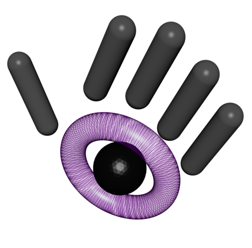

/* \mainpage ManuvrOS Documentation

        __  ___                             ____  _____
       /  |/  /___ _____  __  ___   _______/ __ \/ ___/
      / /|_/ / __ `/ __ \/ / / / | / / ___/ / / /\__ \  
     / /  / / /_/ / / / / /_/ /| |/ / /  / /_/ /___/ /  
    /_/  /_/\__,_/_/ /_/\__,_/ |___/_/   \____//____/   

A cross-platform real-time, event-driven "Operating System" for asynchronous applications. It was intended to make it easier to write asynchronous, cross-platform IoT applications.

----------------------
#### What is in this repository:
**./doc**:  Documentation related to this project. The code base is being converted to doxygen. It can be [viewed online](http://manuvr.io:8080/), but will not be guaranteed to be what you have in front of you. The doc can be built with the command...

    make docs

**./doc**:  Location for generated documentation.

**./lib**:  Third-party libraries required for a project.

**./ManuvrOS**:  The ManuvrOS source code.

**./tests**:  Automated tests.

##### Demo project files
    ./downloadDeps.sh   A script to download dependencies.
    FirmwareDefs.h      Build-time configuration for the demo project.
    main.cpp            
    Makefile

----------------------
##### If you intend on using ManuvrOS in an Arduino-esque environment...
Arduino support has been shelved for the moment. It may make a re-appearence in the future.

----------------------
##### If you intend on using ManuvrOS as an application framework in a "big" environment (such as a Raspberry Pi, or desktop)

Hopefully-positive changes are gradually happening to the build process. For now...

You can build the demo application with

The Raspi demo application:

    make raspi

Demo application on straight-up linux (uses pthreads):

    make

Or for the same thing with debug symbols:

    make debug

----------------------
#### High-level TODO list
-   Clean up the unit tests that exist, and merge in some that aren't in the testbench yet.
-   Verify that ManuvrOS works correctly when built as 64-bit.
-   Write an autoconf script to choose target and features, detect env, etc...
-   Continue extending session support to cover OSC, CoAP, along with their commonly-associated wire-encodings (notably CBOR). Currently, only MQTT and Manuvr native are supported.
-   Incorporate assertions into preprocessor logic to case-off DEBUG? Investigate.
-   Support additional threading models (Zephyr? RIOT? mbed?).

----------------------
#### License
Original code is Apache 2.0.

Code adapted from others' work inherits their license terms, which were preserved in the commentary where it applies.

----------------------
#### Cred:
The ASCII art in this file was generated by [this most-excellent tool](http://patorjk.com/software/taag).

Some of the hardware drivers are adaptions from other's open code. This is noted in each specific class so derived.

*/
