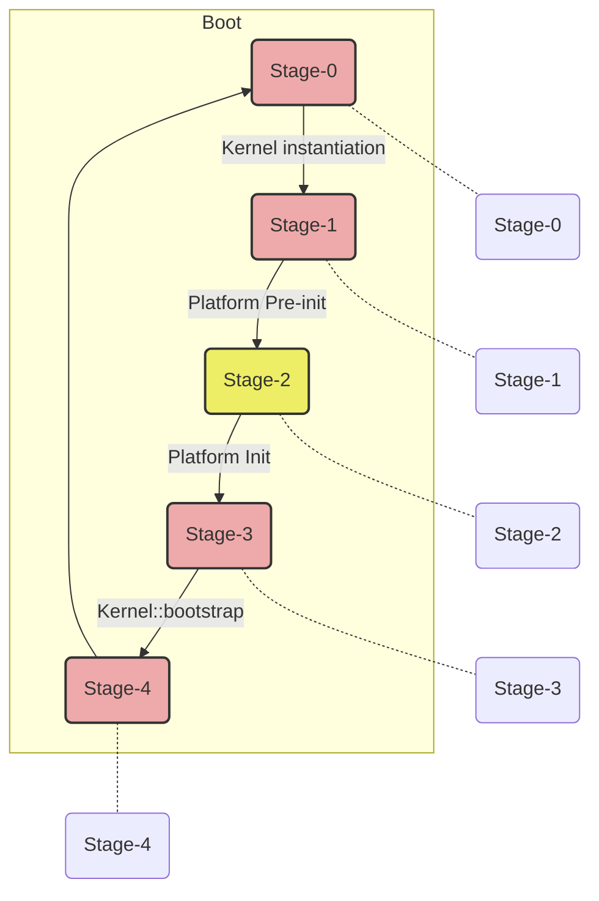

## Important lifecycles in ManuvrOS

### Boot

```mermaid
  graph TD
    a(Stage-0)
    b(Stage-1)
    c(Stage-2)
    d(Stage-3)
    e(Stage-4)

    s0(Stage-0)
    s1(Stage-1)
    s2(Stage-2)
    s3(Stage-3)
    s4(Stage-4)

    subgraph Boot
    a--> |Kernel instantiation|b
    b--> |Platform Pre-init|c
    c--> |Platform Init|d
    d--> |Kernel::bootstrap|e
    e-->a
    end

    a-.-s0
    b-.-s1
    c-.-s2
    d-.-s3
    e-.-s4


    style a fill:#eaa,stroke:#333,stroke-width:2px;
    style b fill:#eaa,stroke:#333,stroke-width:2px;
    style c fill:#ee6,stroke:#333,stroke-width:2px;
    style d fill:#eaa,stroke:#333,stroke-width:2px;
    style e fill:#eaa,stroke:#333,stroke-width:2px;

```
